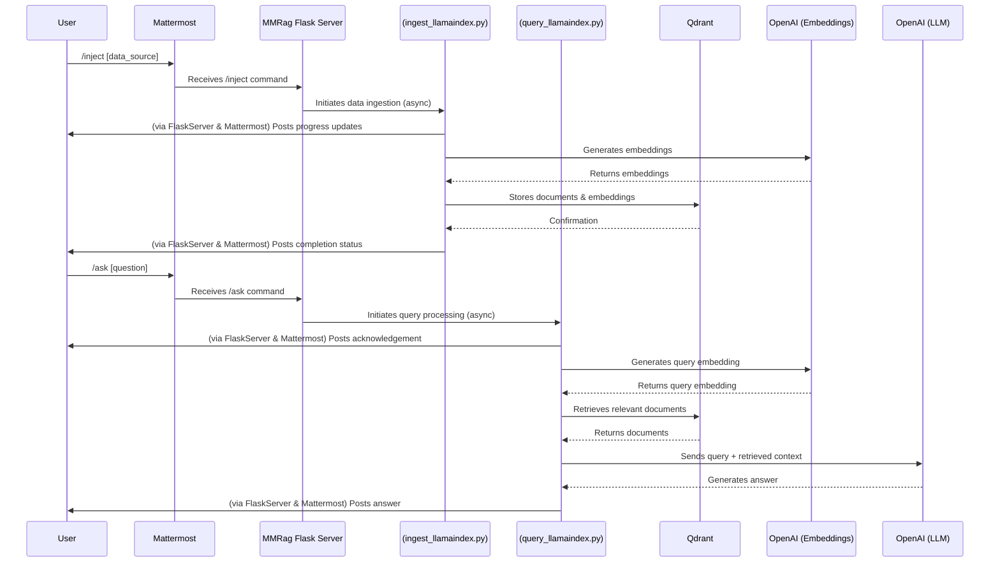

# MMRag: RAG Pipeline Overview

## 1. Introduction

The `MMRag` project implements a Retrieval Augmented Generation (RAG) pipeline to provide question-answering capabilities within a Mattermost environment. This system allows users to ingest data from various sources into a searchable vector store and then query this data using natural language. The pipeline leverages LlamaIndex for orchestration, Qdrant for vector storage, and OpenAI models for embedding and language generation, all served via a Flask backend integrated with Mattermost slash commands.

## 2. RAG Pipeline Stages

The pipeline consists of two main workflows: Data Ingestion and Query Handling.

### 2.1. Data Ingestion

The data ingestion process is primarily handled by the [`ingest_llamaindex.py`](ingest_llamaindex.py:1) script, triggered via the `/inject` (or `/injest`) Mattermost slash command processed by [`server.py`](server.py:1).

*   **Trigger:** User executes `/inject [options] [source1 source2 ...]` in Mattermost.
*   **Sources:**
    *   **Mattermost Channel History:** If no explicit source is provided, the history of the current Mattermost channel is fetched and processed.
    *   **URLs:** Web pages can be ingested using `BeautifulSoupWebReader`.
    *   **Local Files/Directories:** Local data is loaded using `SimpleDirectoryReader`.
*   **Processing Steps:**
    1.  **Document Loading:** Data is loaded from the specified sources.
    2.  **Text Splitting/Chunking:** Documents are split into smaller, manageable chunks (nodes) using `llama_index.core.node_parser.SentenceSplitter` to ensure they fit within the context window of the embedding and language models.
    3.  **Embedding Generation:** Each node's content is converted into a vector embedding using an OpenAI embedding model (e.g., `text-embedding-3-large` by default) via `llama_index.embeddings.openai.OpenAIEmbedding`.
    4.  **Qdrant Collection Management:**
        *   The system can use an existing Qdrant collection or create a new one.
        *   The `--purge` option allows for deleting and recreating a collection before ingestion.
*   **Orchestration:** The LlamaIndex `IngestionPipeline` ([`ingest_llamaindex.py:90`](ingest_llamaindex.py:90)) orchestrates transformations like node parsing. Parallel processing with adaptive worker scaling is implemented for efficient document processing ([`ingest_llamaindex.py:220`](ingest_llamaindex.py:220)).
*   **Storage:**
    *   **Vector Embeddings:** The generated embeddings and associated metadata are stored in a specified Qdrant collection using `llama_index.vector_stores.qdrant.QdrantVectorStore` ([`ingest_llamaindex.py:347`](ingest_llamaindex.py:347)).
    *   **Document Store (LlamaIndex):** LlamaIndex's `StorageContext` may also persist document metadata (docstore) and index structures locally ([`ingest_llamaindex.py:359`](ingest_llamaindex.py:359)) to complement the Qdrant vector store, particularly for operations like BM25 retrieval.
*   **Feedback:** The [`server.py`](server.py:471) script provides real-time, threaded feedback to the Mattermost channel during the ingestion process.

### 2.2. Query Handling & Response Generation

This workflow is triggered by the `/ask` Mattermost slash command and primarily managed by [`query_llamaindex.py`](query_llamaindex.py:1), orchestrated by [`server.py`](server.py:91).

*   **Trigger:** User executes `/ask [options] <your query text>` in Mattermost.
*   **Query Input:** The user's natural language question.
*   **Core Components (LlamaIndex `Settings`):**
    *   LLM: `llama_index.llms.openai.OpenAI` (e.g., `gpt-4.1-mini`).
    *   Embedding Model: `llama_index.embeddings.openai.OpenAIEmbedding` (e.g., `text-embedding-3-large`).
*   **Retrieval Strategy:**
    1.  **Index Loading:** The system loads the LlamaIndex `VectorStoreIndex` using the specified Qdrant collection via `QdrantVectorStore` ([`query_llamaindex.py:427`](query_llamaindex.py:427)). The `StorageContext` is used to potentially load a local docstore for hybrid search components ([`query_llamaindex.py:453`](query_llamaindex.py:453)).
    2.  **Hybrid Search:** By default, a custom `HybridRetriever` ([`query_llamaindex.py:29`](query_llamaindex.py:29)) is used, combining:
        *   **Dense Retrieval:** `llama_index.core.retrievers.VectorIndexRetriever` performs semantic search using vector embeddings from Qdrant.
        *   **Sparse Retrieval:** `llama_index.retrievers.bm25.BM25Retriever` performs keyword-based search on the documents (often loaded from the local docstore).
    3.  **Metadata Filtering:** Supports filtering retrieved documents based on metadata using `llama_index.core.vector_stores.ExactMatchFilter` ([`query_llamaindex.py:484`](query_llamaindex.py:484)).
*   **Node Post-processing & Ranking:** After initial retrieval, nodes undergo several post-processing steps to refine the context sent to the LLM:
    1.  **Maximal Marginal Relevance (MMR):** A custom `MMRNodePostprocessor` ([`query_llamaindex.py:168`](query_llamaindex.py:168)) is applied by default to diversify results and maintain relevance, balancing similarity to the query with dissimilarity among selected nodes. This can be toggled with `--no-mmr` or `--mmr` flags in the `/ask` command.
    2.  **Long Context Reordering:** `llama_index.core.postprocessor.LongContextReorder` ([`query_llamaindex.py:538`](query_llamaindex.py:538)) rearranges nodes to improve the LLM's ability to find relevant information in long contexts.
    3.  **Conditional Reranking/Compression (Optional):**
        *   If a Cohere API key is available and `RETRIEVAL_COMPRESS_CONTEXT` is true, `llama_index.postprocessor.cohere_rerank.CohereRerank` ([`query_llamaindex.py:545`](query_llamaindex.py:545)) can be used for advanced reranking and context compression.
        *   If `RETRIEVAL_RERANK_TOP_N` is greater than 0, `llama_index.postprocessor.sbert_rerank.SentenceTransformerRerank` ([`query_llamaindex.py:560`](query_llamaindex.py:560)) can be used with a cross-encoder model for further reranking.
*   **Response Synthesis:**
    *   The refined set of nodes (context) and the original query are passed to a LlamaIndex response synthesizer (`llama_index.core.response_synthesizers.get_response_synthesizer`, [`query_llamaindex.py:570`](query_llamaindex.py:570)).
    *   An OpenAI LLM (e.g., `gpt-4.1-mini`, configured via `OPENAI_MODEL_LLM`) generates the final answer based on the provided context and query.
*   **Output:** The generated answer is formatted and posted back to the originating Mattermost channel by [`server.py`](server.py:436).

## 3. Technology Stack & Tools

The `MMRag` project utilizes the following technologies and tools:

*   **Programming Language:** Python (3.9+ recommended)
*   **Backend Framework:** Flask (for handling HTTP requests from Mattermost)
*   **RAG Orchestration & Core Components:** LlamaIndex
    *   `llama-index-core`
    *   `llama-index-llms-openai`
    *   `llama-index-embeddings-openai`
    *   `llama-index-vector-stores-qdrant`
    *   `llama-index-readers-web` (includes `BeautifulSoupWebReader`)
    *   Conditional: `llama-index-postprocessor-cohere-rerank`, `llama-index-postprocessor-sbert-rerank`, `llama-index-evaluation`
*   **Vector Database:** Qdrant (for storing and searching vector embeddings)
    *   Client: `qdrant-client`
*   **Language Models (LLMs):** OpenAI
    *   Generation: GPT series (e.g., `gpt-4.1-mini` default, configurable via `OPENAI_MODEL_LLM`)
    *   Embeddings: OpenAI embedding models (e.g., `text-embedding-3-large` default, configurable via `OPENAI_MODEL_EMBEDDING`)
    *   Client: `openai` Python library
*   **Containerization:** Docker, Docker Compose (for deployment and managing services like Qdrant)
*   **Mattermost Integration:**
    *   Slash Commands (`/inject`, `/ask`)
    *   Mattermost REST API (for asynchronous replies and threaded messages)
*   **Key Python Libraries & Utilities:**
    *   `requests`: For making HTTP calls (e.g., to Mattermost API).
    *   `python-dotenv`: For managing environment variables.
    *   `click`: For building command-line interfaces (used in `ingest_llamaindex.py` and `query_llamaindex.py`).
    *   `shlex`: For parsing command-line arguments from Mattermost text.
    *   `beautifulsoup4` (bs4): Dependency for `BeautifulSoupWebReader` used in URL ingestion.
    *   `unstructured`: Often a dependency for various LlamaIndex document readers.
    *   `numpy`: Used in the custom MMR postprocessor for cosine similarity calculation.
    *   (Optional, for URL handling in server): `langchain`, `langchain-community`

This combination of tools enables `MMRag` to provide a robust and extensible RAG system integrated directly into the Mattermost user experience.
